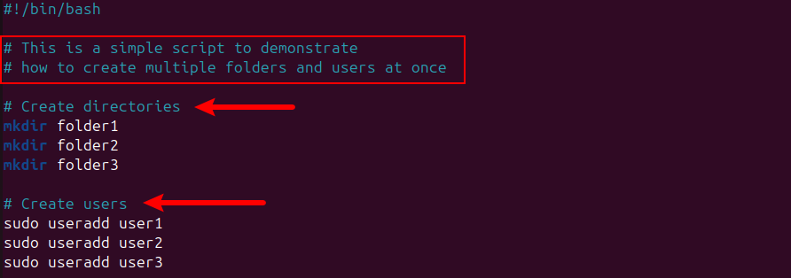
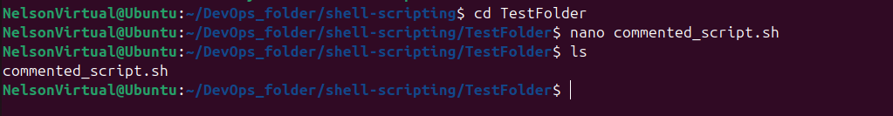
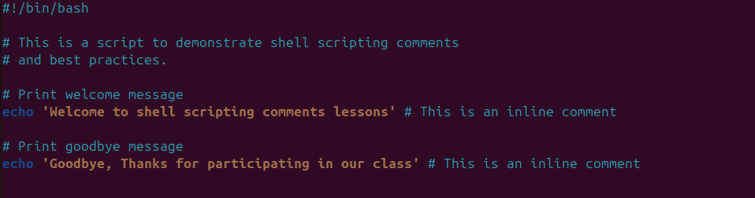
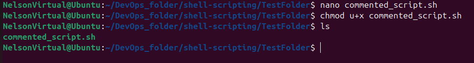
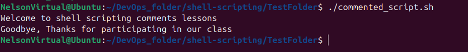

# linux-shell-scripting-comments
This project demonstrate effective commenting practices in shell scripting. Comments enhances script readability, maintainability and collaboration.

## Comments
Comments are lines in code that are ignored by the interpreter. Comments helps to document the purpose and logic of your code, making it easier for others (and yourself) to follow and understand the script's functionality.

### Single line comment
A single line comment in Bash starts with the '#' symbol. Anything following the symbol on the same line is treated as a comment and is not executed.

```bash
# This is a single line comment in Bash
echo "Hello, welcome to shell scripting, now you are learning to comment on your code."
```

### Multiple Single line comments
To write more than one line of comments, multiple single-line comments can be used.

```bash
# This is one line of comment
# This is another line of comment to demonstrate multiple single line comments
echo "Here is the actual code that will be executed"
```



## Practical Demonstration of Script comments

### Creating a TestFolder
Let us begin by creating a folder called 'TestFolder' to hold our work.


Now navigate to the new directory by entering the following command;

```bash
$ cd TestFolder
```

### Creating the script
Enter the following code to create a new script (commented_script.sh) in the TestFolder directory;

```bash
$ nano commented_script.sh
```

Save and close the script.

Run ```ls``` in the TestFolder directory to list the directory files. 'commented_script.sh' should be listed showing it has been successfully created and saved.



### Adding the 'shebang' and other content to the script
Open the script ```nano commented_script.sh``` and enter the following content including the shebang

```bash
#!/bin/bash

# This is a script to demonstrate shell scripting comments
# and best practices.

# Print welcome message
echo 'Welcome to shell scripting comments lessons' # This is an inline comment

# Print goodbye message
echo 'Goodbye, Thanks for participating in our class' # This is an inline comment
```



### Changing Script Permission
Now that the script has been created and saved, let's change its permission to make it executable.

```bash
$ chmod u+x commented_script.sh
```



### Executing the Script
To execute the script run the following command;

```bash
$ ./commented_script.sh
```


The output clearly show that our script run successfully printing out the code section and ignoring every other comment.

#### Complete Script
This is the complete script to automate the process of creating the directory, moving the script into the directory and listing the directory content. When this script is run the output will be the 'welcome' and the 'goodbye' messages as demonstrated earlier.

```bash
#!/bin/bash

# This is a script to demonstrate shell scripting comments
# and best practices.

# Step 1: Create directory "TestFolder"
mkdir -p TestFolder   # Create if not exists

# Step 2: Move into TestFolder
cd TestFolder || exit   # Enter directory or exit if fails

# Step 3: List directory contents
ls -l   # Will show what's inside TestFolder if any

# Step 4: Print welcome message
echo "Welcome to shell scripting comments lessons"  # Inline comment

# Step 5: Print goodbye message
echo "Goodbye, Thanks for participating in our class"  # Inline comment
```

## Best Commenting practices
1. Clarity: Write clear and concise comments that explain the 'why' behind the code, not just the "what".
2. Maintainability: Keep comments updated as you modify the code to remain relevant and useful.
3. Usefulness: Comment on complex or non-obvious parts of the script to provide insights into your thought process and decision-making.
4. Avoid overcommenting: Don't comment on every line of code especially if the code is self explanatory.

### Conclusion
Effective commenting is a critical practice in shell scripting that significantly improves code quality. By following best practices —such as writing clear, concise, and relevant comments while avoiding redundancy, developers can create scripts that are easier to understand, maintain, and share. Adopting these habits fosters better collaboration and ensures that scripts remain accessible and useful over time, benefiting both the original author and future contributors.